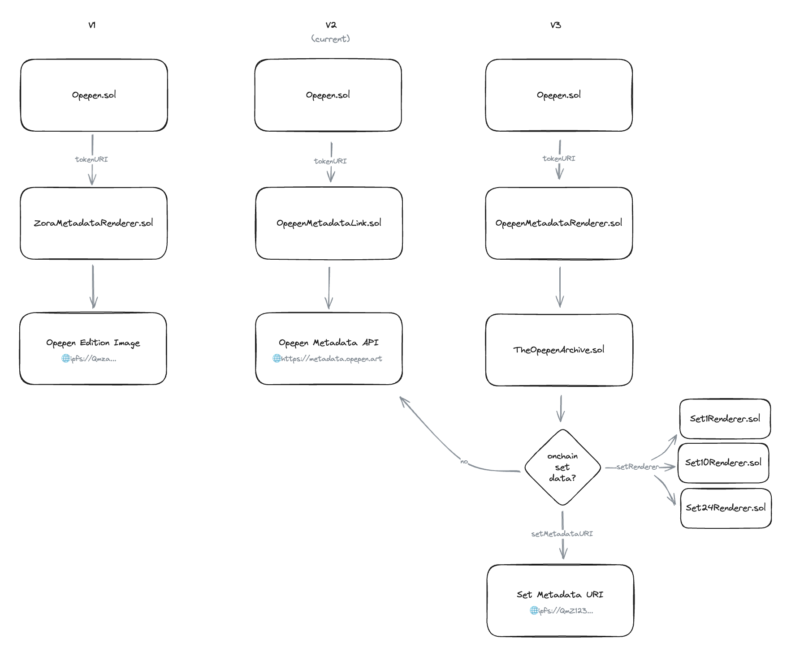

# Opepen Contracts V3

## Architecture

The setup for rendering Opepen metadata:



As a first act in moving onchain, we want to be able to resolve the edition size for each token without leaving the EVM.

- We have 6 edition sizes. To identify each of them we need 3 bits (`110` would be `6`).
- Per slot (256 bits) we can store up to 85 tokens (`256/3 = 85.33`)
- So we batch store the token ID -> edition size in 200 groups of 80 (just because of the provenance of 200 & 80 in opepen land)

## Working with Hardhat

Try running some of the following tasks:

```bash
npx hardhat accounts # or the shorthand via `hh accounts`
npx hardhat compile
npx hardhat clean
npx hardhat test
npx hardhat node
npx hardhat help
```

## Deploying contracts

We use Ignition for contract deployments.

